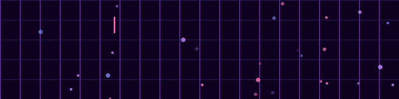

<!-- Header Banner -->
<div align="center">
  
<div align="center">
  
</div>

### `< Front-End Developer · AI Enthusiast />`

[](https://reactjs.org/)
[](https://nextjs.org/)
[](https://www.typescriptlang.org/)
[](https://tailwindcss.com/)
[](https://anthropic.com/)

</div>

---

## 🌸 About Me

```typescript
const zahra: Developer = {
  name: "Zahra Reisi",
  role: "Front-End Developer",
  education: "MSc Artificial Intelligence @ IUT",
  experience: "~3 years",
  location: ["Canada 🇨🇦", "Germany 🇩🇪", "Türkiye 🇹🇷", "Iran 🇮🇷"],
  currentFocus: ["AI-powered products", "LLMs", "Anthropic API",],
  learning: ["Anthropic API", "Prompt Engineering", "RAG patterns"],
  status: "open to AI-powered teams ✨",
};
```

> *Front-End Developer with nearly 3 years of experience building scalable web applications using React and Next.js, holding a Master's in Artificial Intelligence. Passionate about AI-powered products and designing experiences that simplify complex workflows.*

---

## ⚡ Stats

<div align="center">

| 🗓 Experience | 🏢 Companies  | 🌍 Countries |
|:---:|:---:|:---:|:---:|
| ~3 years | 4 | 4 |

</div>

---

## 🛠 Tech Stack

### 🎀 Frontend


### 💜 State & Data


### 🤖 AI / LLM


### 🔧 Tools


---

## 🌸 Currently Learning

```
AI Journey Progress ━━━━━━━━━━━━━━━━━━━━━━━━━━━━━━━━━━━━━━━━

LLM integration & Anthropic API    ████████████████████░░░░  85%
AI-assisted dev (Claude, Lovable)  ██████████████████░░░░░░  78%
AI product design & UX             █████████████████░░░░░░░  72%
Prompt engineering & RAG patterns  ████████████████░░░░░░░░  65%
```

---

## 💼 Work Experience

### 🏭 Canadian Metal · Türkiye (Remote)
**Front-End Developer** — *May 2025 – April 2026*

```
✦ Built AI-powered material scanning using ML models (type, volume, price)
✦ Engineered real-time group & private chat system with WebSockets
✦ AI-driven ticket autofill → reduced manual data entry by ~60%
✦ Built competitor price comparison module across multiple scrap yards
✦ Live notification system + operational dashboards (drag-and-drop, multi-select)
✦ Rebranding of Seller Web App: landing page, city coverage pages, offer form
```

---

### 🏥 Telemedicall · Germany (Remote)
**Front-End Developer** — *August 2024 – May 2025*

```
✦ Founding frontend dev on cloud-based AI telemedicine platform
✦ Real-time video call system with audio, video & media switching (Agora SDK)
✦ AI-integrated chat module + real-time messaging with file sharing
✦ AI lab report parsing → saves ~15 min manual entry per patient visit
✦ Full patient management: registration, profile, visit history, biomarker tracking
✦ Flexible appointment scheduling: in-person, online & advisory consultations
✦ Provider network with profile browsing & cross-provider scheduling
```

---

### 🎮 Nojahan · Iran (Remote)
**Front-End Developer** — *February 2024 – July 2024*

```
✦ Gamified learning platform with 25,000+ downloads
✦ Stack: TypeScript · React.js · Tailwind CSS · React Query
✦ Worked on main web app + admin panel
✦ Participated in code reviews & architectural discussions
```

---

### 🛢 RDSysCo · Canada (Remote)
**Junior Front-End Developer** — *July 2023 – November 2023*

```
✦ ERP system for Canadian oil company using React.js
✦ End-to-end tests with Cypress → ~90% test coverage
✦ Collaborated with senior devs on design, implementation & deployment
```

---

## 🎓 Education

| Degree | Field | University | Year |
|--------|-------|------------|------|
| 🎓 Master's | Artificial Intelligence | Isfahan University of Technology | 2021 – 2023 |
| 🎓 Bachelor's | Computer Software Engineering | Shahrekord University | 2016 – 2020 |

---

## 📊 GitHub Contributions

<div align="center">


</div>

---

## 🔗 Connect

<div align="center">

[](https://github.com/zahra8624)
[](https://www.linkedin.com/in/zahra-reisii/)
[](mailto:Sania.8624@gmail.com)

</div>

---

<div align="center">

```
/* always shipping, always learning */
while (alive) {
  eat();
  sleep();
  code();   // 💜
  repeat();
}
```

*Made with 💜 & ☕ by Zahra Reisi*

</div>
